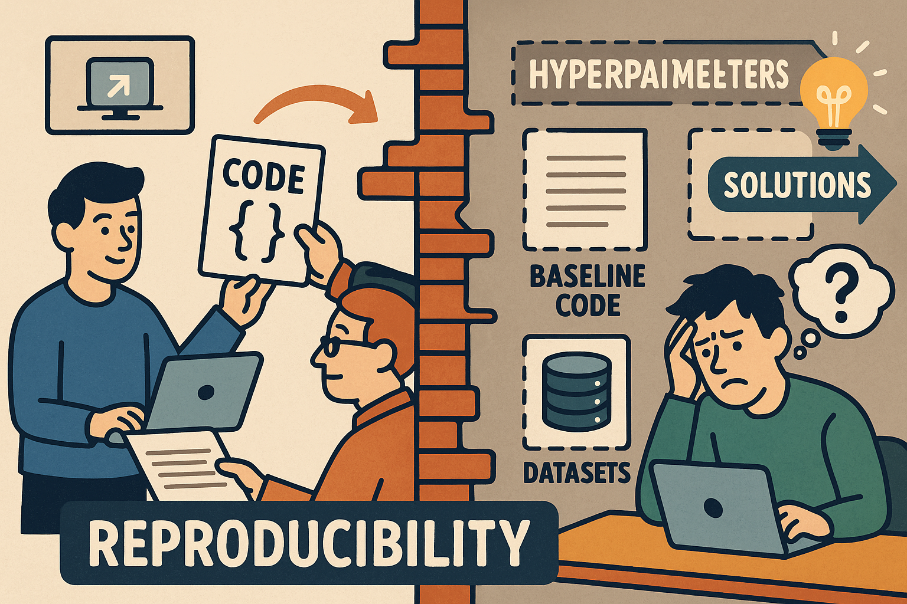

<!DOCTYPE html>
<html>
<head>

</head>
<body>

  

This reproducibility package was prepared for the paper titled "<em>We share our code online</em>: Why this is not enough to ensure reproducibility and progress in recommender systems research" and submitted  to the ACM RecSys 2025.  For the uploaded picture, the credit goes to ChatGPT.

</body>
</html>  

